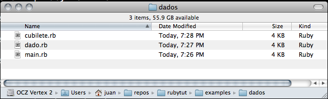
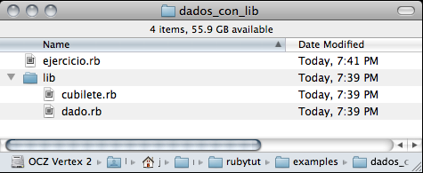
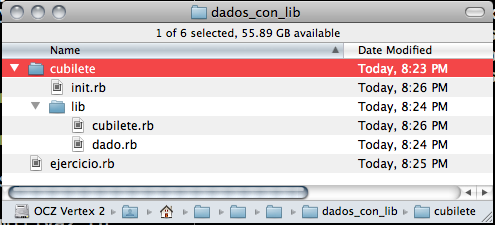

!SLIDE
# QUE ES RUBY #

!SLIDE smbullets 

## Ruby es un lenguaje interpretado

* todo es un objeto
* todo se evalúa como una expresión
* interpretado
* muy alto nivel

!SLIDE commandline center

## Palabras clave 

<code>
    @@@ ruby
    BEGIN END alias and begin break case 
    class def defined do else elsif end 
    ensure false for if in module next nil 
    not or redo rescue retry return 
    self super  then true undef unless 
    until when while yield
</code>

!SLIDE smaller 

## El clásico "Hola mundo!"

Crear un archivo llamado hola.rb: 

     @@@ ruby
     #!/usr/bin/env ruby
     puts "Hola wadus!"

Ejecutar esto en la misma carpeta 

     @@@ bash 
     chmod a+x hola.rb
     mv hola.rb hola
     ./hola
     Hola wadus!
    

!SLIDE 

## El lado oscuro de Ruby

     @@@ ruby
     method(:puts).call "Hola wadus!"

!SLIDE bullets incremental

# Comentarios 

De una línea

    @@@ ruby
    wadus = wadus + 1   # le sumo 1 a wadus

De varias 

    @@@ ruby
    =begin
    Me gusta poner comentarios largos porque
    explican mejor el código
    =end
    wadus = wadus + 1

!SLIDE bullets incremental

# Tipos de datos simples

* <code>i = 27</code>
* <code>c = ?x</code>
* <code>wadus = "Hola me llamo Wadus"</code>
* <code>flag = false</code>

!SLIDE 

# Cadenas

Se define con comillas dobles

    str = "Las cadenas son así de fáciles"

o simples

    otra_str = str + ' y difíciles'

!SLIDE smaller

# Interpolación de cadenas

    @@@ ruby
    str = "cadenas"
    otra_string = "Las #{str} son así de fáciles"
    libro = "Las #{1000+1} noches"
    esto_peta = 'Las #{str} son así de difíciles'

**Moraleja** ¡Cuidado con las comillas simples!

!SLIDE

# Interpolando en el día a día 

    @@@ ruby
    1.upto(100).each do |x|
       if x % 2 == 1 then 
          puts "El #{x} es impar"  
       end 
    end

!SLIDE

# ¿Qué se puede hacer con cadenas?

http://ruby-doc.org/core/classes/String.html

!SLIDE

# ¡Podemos ejecutar comandos!

    @@@ ruby
    res1 = `ps -ef`
    res2 = %x[uname -a]

!SLIDE incremental

# Expresiones regulares

* Esas para otro día! ;)

!SLIDE smaller

# Arrays 

Pueden contener datos de cualquier tipo

Tantos datos como se quiera

    @@@ ruby
    >> otro = ["a", "b", "c", "d"]
    => ["a", "b", "c", "d"]

    >> arr = %w(a b c d)
    => ["a", "b", "c", "d"]

    >> arr + otro
    => ["a", "b", "c", "d", "a", "b", "c", "d"]

    >> arr[3]
    => "d"

Los verdaderos programadores empiezan a contar por el cero

!SLIDE

## Qué se puede hacer con arrays

http://www.ruby-doc.org/core/classes/Array.html

!SLIDE smaller code

    @@@ ruby
    >> arr
    => ["a", "b", "c", "d"]

    >> arr[3]
    => "d"

    >> a = ["a","b","c","d","e"]
    => ["a", "b", "c", "d", "e"]

    >> a*2
    => ["a", "b", "c", "d", "e", "a", "b", "c", "d", "e"]

    >> a + %w(uno dos tres)
    => ["a", "b", "c", "d", "e", "uno", "dos", "tres"]

!SLIDE smaller 

## ¿Me lo cambias o no?

    @@@ ruby
    >> a
    => ["a", "b", "c", "d", "e"]

    >> a << "f"
    => ["a", "b", "c", "d", "e", "f"]

    >> a == ["a","b","c", "d", "e"]  # ya no es el original!
    => false

    >> a == ["a","b","c","d","e","f"]
    => true

    >> a.at(3)   # ¿por qué número empezamos a contar?

!SLIDE 

## Los Arrays guardan el orden de sus elementos

    @@@ ruby
    >> a = %w(knapp pantulis cantorrodista 
              vieron maguisso izgaka) 
    => ["knapp", "pantulis", "cantorrodista", 
           "vieron", "maguisso", "izgaka"] 

Pero se pueden reordenar

    @@@ ruby
    >> a.sort
    => ["cantorrodista", "izgaka", "knapp", 
        "maguisso", "pantulis", "vieron"] 
    >> a   # ¿qué devuelve esto?
    
!SLIDE 

# Ejercicio 1 

## Hacer un programa que rellene la primitiva

## Generar un array con los 6 números, sin que se repitan    

!SLIDE 

# Hash

* Es como un listín telefónico

      @@@ ruby
      telefonos = { 
        :juan_lupion => '670234502', 
        :ivan_lopez => '666869285',
        :natali => '28195810',
        :javieron => '8869867110
      }

!SLIDE 

* En Ruby 1.9.x se puede usar:

      @@@ ruby
      telefonos = {
        juan_lupion: '670234502',
        ivan_lopez: '66686285',
        nataly:  '28195810',
        javieron: '686928591'
      }

!SLIDE 

# Qué se puede hacer con Hashes

http://www.ruby-doc.org/core/classes/Hash.html

!SLIDE 

# Los hashes no guardan el orden de sus contenidos

      @@@ ruby
      hash1 = { :a => 1, :b => 2, :c => 3}
      hash2 = { :b => 2, :c => 3, :a => 1}

      hash1 == hash2
      => true

!SLIDE small

## Más cosas con hashes

    @@@ ruby
    telefonos.keys
    => [:juan_lupion, :ivan_lopez, :javieron] 

    telefonos[:javieron] 
    => "686928591"

    telefonos.sort
    ruby-1.8.7-head > telefonos.sort
    NoMethodError: undefined method `<=>' for :juan_lupion:Symbol
 	from (irb):2:in `<=>'
  	from (irb):2:in `sort'
	from (irb):2

Los hashes NO ORDENAN!!!

!SLIDE 

# Pero en Ruby 1.9.x sí

    @@@ ruby
    ruby-1.9.2-p0 > telefonos.sort
     => [[:ivan_lopez, "66686285"], 
         [:javieron, "686928591"], 
         [:juan_lupion, "670234502"]] 

!SLIDE bullets incremental smaller

# ¿Cuándo usar hashes y cuando arrays?

* Usaremos Arrays si nos interesa el orden en que se guardan las cosas
* Pero en los Hashes la búsqueda es más rápida que en un Array 
* (si me sé la clave)

!SLIDE 

# Funciones

     @@@ ruby
     def imprime(valor)
         puts "He recibido = #{valor}"
     end  
      
     imprime("Hola")
     
     imprime "Hola"   # es más claro!

!SLIDE 

# Ojo con lo que devuelves

      @@@ ruby
      def imprime(valor)
         puts "He recibido = #{valor}"
      end  

      cadena = imprime("HOLA")
      He recibido HOLA      

      cadena
      ==>   ## ? 

!SLIDE 

# Ojo con lo que devuelves

      @@@ ruby
      def imprime(valor)
         puts "He recibido = #{valor}"
         return true  # el quid de la cuestión
      end  

      cadena = imprime("HOLA")
      He recibido HOLA      

      cadena
      ==> true

!SLIDE 

# Puedo pasar todos los parámetros que yo quiera

      @@@ ruby
      def sumalos(arg1, arg2, arg3)
         arg1 + arg2 + arg3
      end

      sumalos(3,4,5)
      => 12
      sumalos 3,4,5 # no queda tan bonito
      => 12

!SLIDE smaller

# Puedo pasar **todos** los parámetros que yo quiera
  
* Splat operator 
    
      @@@ ruby
      def sumalos(*args)
         sum = 0
         args.each do |x|
           sum +=x
         end
         sum  # o return sum!  pero que no se olvide!
      end

      >> sumalos(3,4,5)
      => 12
      >> sumalos(3,4,5,25)
      => 37

!SLIDE smaller

# El splat funciona al revés!

      @@@ ruby
      >> mi_arr = [1,2,3,4,5,6,7,8]
      => [1, 2, 3, 4, 5, 6, 7, 8]
      >> sumalos(mi_arr) 
      TypeError: Array can't be coerced into Fixnum
	   from (irb):11:in `+'
	   from (irb):11:in `sumalos'
	   from (irb):11:in `each'
	   from (irb):11:in `sumalos'
	   from (irb):17
      >> sumalos(*mi_arr)
      => 36

Esto se usa un montón en Rails 

!SLIDE smaller

# Los hashes como parámetros molones!

     @@@ ruby
     def prueba(opts = {})
        o = {
          :a => 'amarillo',
          :b => 'bioleta',
          :c => 'colorado'
        }.merge(opts)   # Mirar qué hace Array#merge
        
        puts "#{o[:a]} #{o[:b]} #{o[:c]}"
     end  

!SLIDE smaller

# Los hashes en acción

     @@@ ruby
     prueba
     => amarillo bioleta colorado

     prueba({ :b => 'berenjena'})
     => amarillo berenjena colorado

     prueba :c => 'cyan', 
            :a => 'azul'   # BONUS COMBO WIN! 

     => azul bioleta cyan

!SLIDE smaller

# ¿Sabemos lo que es has_and_belongs_to_many?

    @@@ ruby
    class Post < ActiveRecord::Base
       belongs_to :site
       has_and_belongs_to_many :categories, 
                               :class_name => "Category", 
                               :join_table => "posts_categories"
    end

!SLIDE smaller

# Ahora sí lo sabemos

    def has_and_belongs_to_many(name, options = {}, &extension) 
       ... 
    end

!SLIDE 

# CONTROL DE FLUJO #

!SLIDE

## if ... then ... else ... end

     @@@ ruby
     if x < 5 then 
        wadus
     end

     if x < 5 then
        wadus
     else
        wudas
     end

!SLIDE  smaller

## unless ... then ... else ... end

    @@@ ruby
    unless x > 5 then 
       wudas
    end

    unless x > 5 then
       wudas
    else
       wadus
    end

Es lo mismo que 
    @@@ ruby
    if x <= 4 then
       wadus
    else
       wudas
    end

!SLIDE

## one liners!

    @@@ ruby
    
    wadus if x > 5 

    wadus unless x.nil?

!SLIDE

## Pero if ... then .. else ... end son expresiones

    @@@ ruby
    a = if x > 5 then 
         4
        else
         20
        end

    x = unless y > 15 then 4 else 10 end

!SLIDE smaller

## Operador ternario para programadores trastornados

     @@@ ruby

     a = (x > 5) ? 20 : 50

     puts "Tienes #{x} #{x==1 ? 'punto' : 'puntos'}"

No abusar de esto! Se complica y se vuelve ilegible fácilmente! 

!SLIDE 

## Selección múltiples

    @@@ ruby
    case expresion 
      when value1
         wadus1
      when value2
         wadus2
      else 
         wadus3
    end
       
!SLIDE

## Selección múltiple con cadenas
   
   Podemos poner expresiones regulares

    @@@ ruby     

    str = "Esta es una cadena"
    case str
      when "estono" 
         "Caso 1"
      when "estotampoco"
         "Caso 2"
      when /cadena/
         "Caso 3"
      else
         "Nada de lo anterior"
    end

!SLIDE
       
## Selección múltiple con números
  
  Podemos poner rangos

     @@@ ruby
     
     dado = rand(6)   # va de 0 a 5!
     puts case dado+1 
      when 1..3
        "Mala suerte, te ha salido un #{dado}"
      when 4..5
        "Salio un #{dado}"
      when 6
        "La repera! Te salió un #{dado}"
      end

!SLIDE

## Iteración en una lista de elementos 1

while

      @@@ ruby
      list = %w(pantuis natali vieron ivlo)

      i=0

      while i<list.size do
         puts list[i]
         i=i+1
      end
      

!SLIDE

## Iteración en una lista de elementos 2

until

      @@@ ruby
      list = %w(pantulis natali vieron ivlo)

      i=0

      until i==list.size do
         puts list[i]
         i=i+1
      end

!SLIDE

## Iteración en una lista de elementos 3

while en modificador

      @@@ ruby
      list = %w(pantulis natali vieron ivlo)

      i=0

      begin 
         puts list[i]
         i=i+1
      end while i< list.size

!SLIDE

## Iteración en una lista de elementos 4

until en modificador

      @@@ ruby
      list = %w(pantulis natali vieron ivlo)

      i=0

      begin 
         puts list[i]
         i=i+1
      end until i== list.size

!SLIDE

## Iteración en una lista de elementos 5

bucle for sobre el elemento

      @@@ ruby
      list = %w(pantulis natali vieron ivlo)

      for i in list
          puts i
      end

!SLIDE

## Iteración en una lista de elementos 6

Array#each

      @@@ ruby
      list = %w(pantulis natali vieron ivlo)

      list.each do |x|
        puts x
      end

!SLIDE

## Iteración en una lista de elementos 7

loop con while

      @@@ ruby
      list = %w(pantulis natali vieron ivlo)

      i=0
      n=list.size -1

      loop do 
         puts list[i]
         i+=1
         break if i > n
      end

!SLIDE

## Iteración en una lista de elementos 8

loop con until

      @@@ ruby
      list = %w(pantulis natali vieron ivlo)

      i=0
      n=list.size

      loop do 
         puts list[i]
         i+=1
         break unless i <= n
      end

!SLIDE
## Iteración en una lista de elementos 9

iterando con 'times'

      @@@ ruby
      list = %w(pantulis natali vieron ivlo)

      n=list.size

      n.times do |i|
       print list[i]
      end

!SLIDE
## Iteración en una lista de elementos 10

iterando con upto

      @@@ ruby
      list = %w(pantulis natali vieron ivlo)

      n=list.size

      0.upto(n) do |i|
       print list[i]
      end

!SLIDE
## Iteración en una lista de elementos 11

for con un rango

      @@@ ruby
      list = %w(pantulis natali vieron ivlo)

      n=list.size-1

      for i in 0..n do 
        puts list[i]
      end

!SLIDE 

#  BLOQUES

!SLIDE smaller

# ¿Qué hace Array#map con el bloque? 

      @@@ ruby
      
      mi_array = [1,2,3,4]

      mi_array.map!  do |x|
        x*2 
      end

* El bloque es un parámetro que se pasa a la función
* |x| es el parámetro del propio bloque
* En el bloque podemos usar el parámetro como si fuera una variable
* map! se encarga de que este parametro vaya siendo cada elemento del array

!SLIDE smaller

# Con yield podemos implementar nuestra propia version 

      @@@ ruby

      class Array
        def map!
          i = 0
          self.each do |n|
            self[i] = yield(n)   # yield ejecuta el bloque como si fuese
                                 # una funcion
            i = i + 1
          end
        end
      end

!SLIDE smaller

# Esto nos permite crear funciones muy poderosas

    @@@ ruby
    def tag(tag) 
      puts "<#{tag.to_s}>"
        yield
      puts "</#{tag.to_s}>"
    end

    tag(:html) do
      tag(:head) do
        puts "<meta href='wadus'>"
      end
      tag(:body) do
        tag(:h1) do
          puts "Esta es la cabecera"
        end
        tag(:p) do
          puts "El párrafo"
        end
      end
    end

!SLIDE smaller

    @@@ ruby
    ruby tmp/ruby_tags.rb
    <html>
    <head>
    <meta href='wadus'>
    </head>
    <body>
    <h1>
    Esta es la cabecera
    </h1>
    

    El párrafo
    

    </body>
    </html>

!SLIDE smaller

## También podía haber sido con llaves

    @@@ ruby
    tag(:html) do
      tag(:head) {  puts "<meta href='wadus'>" }
      tag(:body) do
        tag(:h1) {  puts "Esta es la cabecera"}
        tag(:p) {  puts "El párrafo" }
      end
    end

* La convención es usar una llave para una sola linea
* do..end cuando se usan varias lineas

!SLIDE smaller

## En Rails se usa por todas partes.

## En helpers:

    @@@ ruby
    <% form_for @person, :url => { :action => "update" } do |person_form|%<
       ...
    <% end %>

## En modelos

    @@@ ruby
    class Organization < ActiveRecord::Base
      has_many :people do
       def find_active
        find(:all, :conditions => ["active = ?", true])
       end
      end
    end

    organization.people.find_active()

!SLIDE 

## Más ejemplos de bloques

    @@@ ruby
    def dosveces
      yield 
      yield
    end

    dosveces { puts "Hola" }

!SLIDE

## Los bloques son cierres (CLOSURES)

    @@@ ruby
    def dosveces_traidora
      x = 1000
      yield
      yield
      puts "x vale : #{x}"
    end

    x = 5
    dosveces_traidora { x += 1 }
    puts "x vale: #{x}"
    
    
* ¿Cuánto vale x en cada puts?

!SLIDE 

## Nombres de bloques

Hasta ahora los bloques que hemos visto eran anónimos, pero pueden recibir un nombre (con &)

     @@@ ruby
     def dosveces
       yield 
       yield
     end

     def cuatro_veces(&block)
       dos_veces(&block)
       dos_veces(&block)
     end            

!SLIDE

## Los bloques con nombre son funciones anónimas

      @@@ ruby
      
      
      def guardame_luego(&block)
        @b = block
      end

      guardame_luego { puts "Hola!" }
      puts "Ya casi estamos!"
      @b.call

!SLIDE 

## Limitaciones con los bloques

* Una función sólo puede recibir un bloque como parámetro

       @@@ ruby
       def funcion_que_no_funciona(&bloque1, &bloque2)

       end

       funcion_que_no_funciona {|x| puts "Hola"} {|y| puts "Adios"}

!SLIDE 

# ¿Ya hemos acabado con los bloques? 

# NO!!!

!SLIDE 

## La auténtica esencia de los bloques: ¡también son objetos!

      @@@ ruby
      
      def guardame_luego(&block)
        @b = Proc.new(&block)
      end

      guardame_luego { puts "Hola!" }
      puts "Ya casi estamos!"
      @b.call

* La misteriosa clase Proc!

!SLIDE 

## Ahora ya podemos definir funciones anónimas al vuelo, sin bloques

      @@@ ruby

      @b= Proc.new {puts "Wadus!"}

      @b.call

* Hemos hecho lo mismo que antes pero sin usar bloques

!SLIDE 

# pero Proc.new tiene más compinches!

!SLIDE

        @@@ ruby
        @b = Proc.new {puts "Wadus!"}
        @c = proc {puts "wadus!"}
        @d = lambda {puts "wadus!"}

        @b.call
        @c.call
        @d.call
        
* La diferencia es que no podemos hacer return dentro de un Proc.new
* En lambda sí

!SLIDE 

# Orientación a Objetos

!SLIDE

* La orientación a objetos es una forma de modelar el mundo real
* En el mundo real estamos rodeados de cosas que disponen de ciertos atributos
* Decimos que todas las cosas que tienen los mismos atributos son de la misma clase

!SLIDE 
* Natalí tiene nombre y apellidos
* Juan tiene nombre y apellidos
* Iván tiene nombre y apellidos
* Javi tiene nombre y apellidos

* Las **personas** tienen nombre y apellidos

!SLIDE smaller

    @@@ ruby

    class Persona 
   
    end 

    natali = Persona.new     # Persona.new es el constructor
    juan = Persona.new
    ivan = Persona.new
    javi = Persona.new

* Pero ahora mismo estos objetos no hacen nada

!SLIDE smaller
 
* Para cargar datos en el constructor, usamos el método <code>initialize</code>

      @@@ruby

      class Persona
         def initialize(nombre, apellidos)
           @nombre = nombre
           @apellidos = apellidos
         end
      end       

      natali = Persona.new('Nelly Natalí', 
                           'Sanchez Rodríguez')
      juan = Persona.new('Juan', 'Lupión')
      javi = Persona.new('Javier', 'Sanchez-Marín')
      ivlo = Persona.new('Ivan', 'Lopez')

!SLIDE smaller

# Cada objeto recuerda los valores de sus variables de instancia      

     @@@ ruby
     puts natali.inspect, juan.inspect, javi.inspect, ivlo.inspect

     #<Persona:0x100138a98 @apellidos="Sanchez Rodríguez", 
                           @nombre="Nelly Natalí">
     #<Persona:0x100138a20 @apellidos="Lupión", 
                           @nombre="Juan">
     #<Persona:0x1001389a8 @apellidos="Sanchez-Marín", 
                           @nombre="Javier">
     #<Persona:0x100138930 @apellidos="Lopez", 
                           @nombre="Ivan">

* ¿Y para leer estos valores desde fuera?

!SLIDE smaller

       @@@ ruby

       natali = Persona.new('Nelly Natalí', 
                            'Sanchez Rodríguez')

       puts natali.nombre

# CATACROCKER!
       
       NoMethodError: undefined method ‘nombre’ 
       for #<Persona:0x100139088>

!SLIDE smaller

* <code>@nombre</code> y <code>@apellidos</code> son variables de instancia
* pero estas variables son internas
* para recuperarlas, tenemos que definir métodos en nuestra clase

!SLIDE smaller

# Accesores 

      @@@ruby
      class Persona
         def nombre
           @nombre
         end 

         def apellidos
           @apellidos
         end

         def initialize(nombre, apellidos)
           @nombre = nombre
           @apellidos = apellidos
         end
      end       
      natali = Persona.new('Nelly Natalí', 
                           'Sanchez Rodríguez')

      puts natali.nombre
      => Nelly Natalí
     
!SLIDE

# ¿Y si quiero modificar los atributos del objeto después de haberlo creado?

!SLIDE smaller

      @@@ruby
      class Persona
         def nombre
           @nombre
         end 

         def apellidos
           @apellidos
         end

         def nombre=(str)
           @nombre = str
         end

         def apellidos=(str)
           @apellidos = str
         end

         def initialize(nombre, apellidos)
           @nombre = nombre
           @apellidos = apellidos
         end
      end       

!SLIDE smaller

       @@@ ruby

      natali = Persona.new('Nelly Natalí', 
                           'Sanchez Rodríguez')

      puts natali.nombre
      => 'Nelly Natalí'            
      natali.nombre = 'Natali'   
      puts natali.nombre
      => 'Natali'

!SLIDE smaller 

# ¿Tenemos que hacer esto para cada variable de instancia que queramos exponer al mundo como atributo?

      @@@ ruby
      def nombre
        @nombre
      end 

      def nombre=(str)
        @nombre = str
      end

!SLIDE smaller

       @@@ ruby
       attr_reader :nombre, :apellidos
       attr_writer :nombre, :apellidos

!SLIDE smaller

# <code>attr_accessor</code> lo pone aún más fácil

       @@@ ruby
       class Persona
          attr_accessor :nombre, :apellidos

          def initialize(nombre, apellidos)
            @nombre = nombre
            @apellidos = apellidos
          end
       end

       ivan = Persona.new('Ivan', 'Lopez')
       puts ivan.nombre
       ivan.apellidos = 'López'
       puts ivan.apellidos

!SLIDE smaller

       @@@ ruby
       class Person
          attr_accessor :name, :surname

          def full_name
            "#{@name} #{@surname}"
          end

          def initialize(nombre, apellidos)
            @name = nombre
            @surname = apellidos
          end
       end

       juan = Person.new('juan','lupion')
       puts juan.fullname

# Principio de Acceso Universal 

!SLIDE 

# La herencia permite especializar las clases (ES-UN)

- Un coche ES UN vehiculo
- Un maquetador ES UNA persona
- Un programador ES UNA persona

!SLIDE smaller

      @@@ ruby
      class BackendEngineer < Person

         def deploy
           puts "cap deploy!"
         end
      end

      class FrontendEngineer < Person

         def slice_layers
           puts "Clickity click"
         end
      end

      javi = FrontendEngineer.new('javi','sanchez-marin')
      juan = BackendEngineer.new('juan', 'lupion')

      javi.slice_layers
      juan.deploy

!SLIDE smaller

* Las clases BackendEngineer y FrontendEngineer son HIJAS DE Person 
* BackendEngineer o FrontendEngineer no definen initialize
* Si una clase no implementa un método, Ruby lo busca en su padre

!SLIDE smaller

      @@@ ruby
      class BackendEngineer < Person
         attr_accessor :favorite_language
         def deploy
           puts "cap deploy!"
         end

         def initialize(name, surname, language)
            @favorite_language = language
            super(name, surname)
         end
      end

      juan = BackendEngineer.new('juan','lupion','ruby')
      puts juan.full_name

!SLIDE smaller

* Las clases son dinámicas
* Se pueden abrir y cerrar varias veces  durante la vida del programa

      @@@ ruby
      class Person
        attr_accessor :name, :surname
        def initialize(name, surname)
          @name = name
          @surname = surname
        end
      end

      natali = Person.new('Nelly','Natali')

      class Person
        def full_name
           "#{@name} #{@surname}"
        end
      end

      puts natali.full_name
     
!SLIDE smaller

* Las clases pueden definir métodos comunes a todas las instancias
* No se invocan sobre una instancia concreta, sino sobre la clase
* Se llaman métodos de clase

      @@@ ruby
      class Person
       def self.salute
         puts "Hola!"
       end
      end

      javi = Person.new('Javi','Sanchez')
      javi.salute
    
      => undefined method `salute' for #<Person:0x100175df8 @apellidos="sanchez", @nombre="javi"> (NoMethodError)

      Person.salute
      => "Hola!"

!SLIDE smaller

* También existen *variables de clase* que son vbles globales
  compartidas entre todas las isntancias de una clase

      @@@ruby
      class Person
        attr_accessor :name, :surname
        @@count = 0 
    
        def initialize(name, surname)
          @@count += 1
          @name = name
          @surname = surname
        end

        def self.count
          @@count
        end
      end
    
      javi = Person.new('Javi','Sanchez')
      Person.count
      => 1
      ivan = Person.new('Ivan','Lopez')
      Person.count
      => 2

!SLIDE smaller

* En los métodos de clase no podemos llamar a las variables de instancia
    * Porque no los estamos llamando sobre una instancia concreta

* En los métodos de instancia (sin <code>self</code>) **sí** podemos llamar a las variables de clase

!SLIDE smaller

# ¿Y para qué sirven los métodos de clase?

!SLIDE smaller 

* Para crear instancias (factoría)

     * Ya conocemos una factoría: <code>Person#new</code>
     * En ActiveRecord: <code>User.find_by_email('vieron@gmail.com')</code>

!SLIDE smaller

* Para modificar clases según se definen

      @@@ ruby
      module ActiveRecord 
         class Base
            def self.validates_presence_of
                wadus wadus wadus...
            end
         end
      end

      class Person < ActiveRecord::Base

         validates_presence_of :email

      end
      
!SLIDE smaller

* Para agrupar métodos similares y que no estén sueltos

      @@@ ruby

      class Mates
         
         def self.raiz_cuadrada(n)
          ...
         end
     
         def self.media(n)
          ...
         end
      end

      puts Mates.raiz_cuadrada(25)
      puts Mates.media [1,2,3,4,5]

* Con esto hemos creado una **librería**

!SLIDE smaller

* Cuando una clase recibe un método que no conoce
* Eleva una excepción (NoMethodError)
* Pero **podemos tomar el control**
* Antes de elevar la excepción, ejecuta  <pre>method_missing</pre>
          
!SLIDE smaller

      @@@ ruby

      class Person
         #... 

         def method_missing(method)
           puts "Ay, qué sofoco, no se hacer 
                 #{method} me desmayo!"
         end
      end

      juan = Person.new('juan','lupion')

      juan.wadus

      => Ay, qué sofoco, no se hacer wadus me desmayo!

!SLIDE smaller

* Rails usa method_missing por todas partes
* Cómo define ActiveRecord estos métodos?

      @@@ ruby
      User.find_by_name_and_email(...)
      User.find_by_email_and_name(...)
      User.find_by_email_and_name_and_zipcode
      User.find_or_create_by_email_and_name_and_...

* Más información: http://sobrerailes.com/2007/04/29/finders-dinamicos-en-activerecord/

!SLIDE smaller

* Ejercicio!
    * Programar una clase Dado
    * Tirar tres dados mil veces
    * Contar cuántas veces salen 3 seises (debería ser unas 5 veces)

!SLIDE  smaller

# ¿Qué hacemos cuando el código crece?
  

* Separamos el código en clases que representan al mundo real
* Separamos el código en diferentes ficheros
  * Normalmente un fichero para cada clase

!SLIDE  smaller

# <code>require</code>

* Es la forma estándar de incluir un archivo desde otro

      @@@ ruby
	  # fichero ejercicio.rb 
	
      require 'cubilete'

      cubilete  = Cubilete.new(:dados => 3)
      cubilete.run(1000)
      cubilete.analyze {|d1, d2, d3| 
		(d1 == 6) && (d2 == 6) && (d3 == 6)
	  }
	
!SLIDE smaller

	@@@ ruby
	# fichero cubilete.rb
	
	require 'dados'
	
	class Cubilete
		def initialize(opts)
			d1 = Dado.new()
			d2 = Dado.new()
			d3 = Dado.new()
		end
	end

	# fichero dados.rb
	
	class Dado
		...
	end

!SLIDE center smaller

# Cómo queda el directorio

* Pero aún podemos querer organizar mejor los ficheros
* Por subdirectorios
	* Para guardar cubilete.rb y dado.rb en un directorio <code>/lib</code>

!SLIDE smaller image 

# Puedo usar rutas en <code>require</code>

	@@@ ruby
	# ejercicio.rb
	require 'lib/cubilete'
		
	cubilete = Cubilete.new
	cubilete.run(:times => 3000)
	cubilete.analyze{|d1,d2,d3| (d1 == 6) && (d2 == 6) 
		                        && (d3 == 6)}
               
!SLIDE smaller smaller

# CATACROCKER!

	@@@
	./lib/cubilete.rb:1:in `require': no such file to load -- dado (LoadError)
		from ./lib/cubilete.rb:1
		from ejercicio.rb:1:in `require'
		from ejercicio.rb:1
             
* <code>require 'lib/cubilete'</code> incluye el fichero cubilete dentro de
ejercicio.rb, igual que si estuviese escrito ahí dentro
* como cubilete.rb hace <code>require 'dado'</code> (sin lib), no lo encuentra en el dir actual

!SLIDE smaller

# ¿La solución? 

	@@@ ruby
	# lib/cubilete.rb
	
	require 'lib/dado'
	class Cubilete 
		...
	end
	
* Con esto funciona... PERO HAY COSAS MAL

!SLIDE smaller

# Así no he construido realmente una funcionalidad de librería

* Acoplamiento a varios niveles
* No puedo incluir cubilete.rb desde un sitio que no sea su directorio padre
* Y además el directorio tiene que llamarse lib o de lo contrario tengo que tocar cubilete.rb
* Esto se solucionaría si pudiese mantener require 'dado' en cubilete.rb 
	
<strong>Concepto clave</strong> RUTA DE CARGA (Load Path)

!SLIDE smaller

# La variable mágica <code>$:</code>

* Cuando hago <code>require 'wadus'</code> Ruby busca un fichero llamado wadus.rb (o wadus.so) en una serie de directorios predeterminados

	  @@@ ruby
	  ruby-1.8.7-head > $:
 	      => ["/lib/ruby/site_ruby/1.8",
          "/ruby/lib/ruby/site_ruby/1.8/i686-darwin10.3.1",
          "/ruby/lib/ruby/site_ruby", 
          "/ruby/lib/ruby/vendor_ruby/1.8", 
          "/ruby/lib/ruby/vendor_ruby/1.8/i686-darwin10.3.1",
          "/ruby/lib/ruby/vendor_ruby",
          "/ruby/lib/ruby/1.8",
          "/ruby/lib/ruby/1.8/i686-darwin10.3.1", 
          "."]
	
* El punto del final, es el directorio actual del fichero que hace el require
	

!SLIDE smaller

* Manipulando <code>$:</code> puedo arreglar el problema anterior

	  @@@ ruby
	  # ejercicio.rb
	  $: << './lib'
	  require 'cubilete'
	  ...
		
* Ahora cuando en <code>cubilete.rb</code> se haga <code>require 'dado'</code>, lo encontrará porque
  
	  @@@ ruby
	  irb
	  ruby-1.8.7-head > $: << './lib'
	  => ["/Users/juan/.rvm/rubies/ruby-1.8.7-head/lib/ruby/site_ruby/1.8",
	      ... 
	      "/Users/juan/.rvm/rubies/ruby-1.8.7-head/lib/ruby/1.8/i686-darwin10.3.1", 
	      ".", "./lib"]
		
* Pero no tiene sentido que la ruta la manipule ejercicio.rb
	* Es código "cliente", la "librería" debería hacerlo por él

		
!SLIDE smaller

     @@@ ruby
	 # ejercicio.rb
	 require 'cubilete/init'
	
	 # cubilete/init.rb
	 $:.unshift File.join(File.dirname(__FILE__),'./lib')
	 require 'cubilete'
	 require 'dado'
	 
	 # cubilete/lib/cubilete.rb
	 class Cubilete
	   ...
	 end
	 
	 # cubilete/lib/dado.rb
	 class Dado
	   ...
	 end
	

!SLIDE smaller

	 @@@ ruby
     # /Users/juan/repos/rubytuty/ejemplos/cubilete/init.rb
     # File.dirname(__FILE__) == /Users/juan/../cubilete 
     $:.unshift File.join(File.dirname(__FILE__),'./lib')
     require 'cubilete'
     require 'dado'

	 
* $:.unshift es igual que $: <<  pero añade por la cabeza
* Añado las dependencias directamente en cubilete/init.rb
* No hago require dentro de los ficheros de lib/
* Puedo incluir cubilete/init.rb desde cualquier otro fichero de Ruby y funcionará bien
* Los plugins, gemas y engines de Rails se basan en este mecanismo

!SLIDE smaller

# Curiosidad: require o load ?

* <code>load</code> hace lo mismo que <code>require</code>
* Incluye el fichero que se le pasa y ejecuta lo que haya 

	  @@@ ruby
	  # main.rb
	  load 'included.rb'
	  say_hello

	  # included.rb
	  puts "Included ha sido incluido"
	  def say_hello
		puts "Hello!"
	  end
	
	  ruby main.rb
	  Included ha sido incluido
	  Hello!
	
!SLIDE smaller

      @@@ ruby
	  load 'included.rb'
	  load 'included.rb'
	  load 'included.rb'
	  say_hello
	
	
	  Included ha sido incluido
	  Included ha sido incluido
	  Included ha sido incluido
   	  Hello!

!SLIDE smaller

	   @@@ ruby
	   require 'included'
	   require 'included'
	   require 'included'
	   say_hello
	    
	   Included ha sido incluido
	   Hello!
	
!SLIDE smaller

* <code>require</code> solo incluye UNA vez

 	  @@@ ruby
  	  ruby-1.8.7-head > require 'included'
	  Fichero incluido
	   => true 
	  ruby-1.8.7-head > require 'included'
	   => false 
	  ruby-1.8.7-head >
	
* En producción hace require, pero en desarrollo hace load
* Así se carga el fichero cada vez sin reiniciar el servidor
* Rails, Sinatra, Nanoc...

